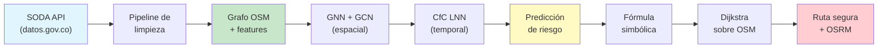
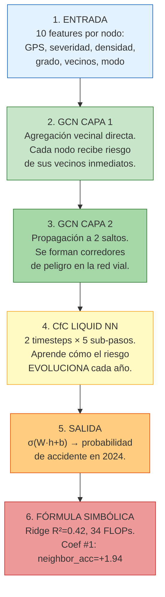
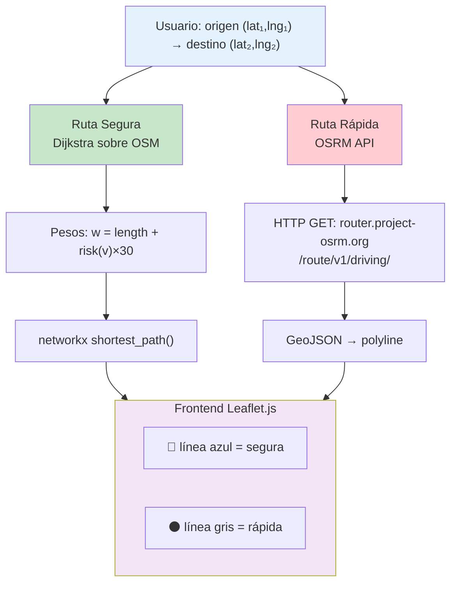

# SafeWay: Sistema Neuronal de Predicción de Riesgo Vial

## Índice

1. [Visión General](#1-visión-general)
2. [Fundamentos Matemáticos](#2-fundamentos-matemáticos)
3. [Pipeline de Datos](#3-pipeline-de-datos)
4. [Arquitectura del Modelo](#4-arquitectura-del-modelo)
5. [Entrenamiento](#5-entrenamiento)
6. [Sistema de Ruteo](#6-sistema-de-ruteo)
7. [Fórmula Simbólica](#7-fórmula-simbólica)
8. [Estructura del Proyecto](#8-estructura-del-proyecto)
9. [Resultados](#9-resultados)
10. [Glosario](#10-glosario)

---

## 1. Visión General

SafeWay es un sistema neuro-simbólico que predice el riesgo de accidentes viales en intersecciones urbanas y calcula rutas seguras evitando zonas peligrosas.

### 1.1 Objetivo

Dado un grafo vial real (calles como aristas, intersecciones como nodos) y datos históricos de accidentes con coordenadas GPS, el sistema:

1. **Aprende** patrones espaciales de riesgo mediante una red neuronal sobre grafos (GNN)
2. **Predice** qué intersecciones serán peligrosas en el futuro
3. **Calcula** rutas que minimizan la exposición al riesgo

### 1.2 Arquitectura General



---

## 2. Fundamentos Matemáticos

### 2.1 Grafos y Grafos Viales

Un **grafo** $G = (V, E)$ consiste en un conjunto de **nodos** $V = \{v_1, ..., v_N\}$ y un conjunto de **aristas** $E \subseteq V \times V$. En SafeWay:

- **Nodo** = intersección vial real con coordenadas GPS $(lat, lng)$ extraídas de OpenStreetMap
- **Arista** = segmento de calle entre dos intersecciones, con atributos físicos (longitud en metros, tipo de vía, velocidad máxima)

Las aristas son **dirigidas** (cada calle tiene dos sentidos con pesos independientes).

### 2.2 Representación Matricial

El grafo se codifica como:

- **Matriz de adyacencia** $A \in \mathbb{R}^{N\times N}$: $A_{ij} = 1$ si existe arista $i \rightarrow j$, $0$ en caso contrario
- **Matriz de grados** $D \in \mathbb{R}^{N\times N}$: matriz diagonal donde $D_{ii} = \sum_j A_{ij}$
- **Matriz de features** $X \in \mathbb{R}^{N\times d}$: cada fila $x_i \in \mathbb{R}^d$ contiene $d$ características del nodo $i$
- **Edge index** $E \in \mathbb{Z}^{2\times M}$: representación sparse donde cada columna $(u, v)$ indica una arista $u \rightarrow v$

### 2.3 Convolución sobre Grafos (GCN)

Una **Graph Convolutional Network** (GCN) agrega información de los vecinos de cada nodo mediante la operación:

$$
H^{(l+1)} = \sigma\left(\tilde{D}^{-\frac{1}{2}} \tilde{A} \tilde{D}^{-\frac{1}{2}} H^{(l)} W^{(l)}\right)
$$

Donde:
- $\tilde{A} = A + I_N$ es la matriz de adyacencia con auto-bucles
- $\tilde{D}_{ii} = \sum_j \tilde{A}_{ij}$ es la matriz de grados normalizada
- $W^{(l)} \in \mathbb{R}^{d_{in} \times d_{out}}$ son los pesos entrenables de la capa $l$
- $\sigma(\cdot)$ es una función de activación no lineal (ReLU)
- $H^{(0)} = X$ son las features de entrada

**Intuición**: cada nodo actualiza su representación como una combinación ponderada de las features de sus vecinos, normalizada por el grado. Esto permite que la información fluya a través del grafo.

#### Capa 1 (agregación directa)
$$
H^{(1)} = \text{ReLU}\left(\tilde{D}^{-\frac{1}{2}} \tilde{A} \tilde{D}^{-\frac{1}{2}} X W^{(1)} + b^{(1)}\right), \quad W^{(1)} \in \mathbb{R}^{10 \times 32}
$$

#### Capa 2 (agregación multi-hop)
$$
H^{(2)} = \text{ReLU}\left(\tilde{D}^{-\frac{1}{2}} \tilde{A} \tilde{D}^{-\frac{1}{2}} H^{(1)} W^{(2)} + b^{(2)}\right), \quad W^{(2)} \in \mathbb{R}^{32 \times 32}
$$

La segunda capa propaga información a 2 saltos de distancia, capturando **corredores de riesgo**: si un nodo A tiene vecinos peligrosos, la GCN detecta que A también está en riesgo.

#### Implementación sparse

En lugar de almacenar $A \in \mathbb{R}^{N \times N}$ (densa, $O(N^2)$ memoria), usamos el **edge index** $E \in \mathbb{Z}^{2 \times M}$ que solo almacena las $M$ aristas existentes:

```python
# msg[u] = h[u] * 1/sqrt(deg[u]*deg[v])
msg = x[src] * norm.unsqueeze(1)
# aggregate: out[v] = sum(msg[u] for u->v)
out = scatter_add(0, dst, msg)
# self-loop
out = out + x * self_norm
# linear transform
out = out @ W + b
```

Esto reduce el costo de $O(N^2 d)$ a $O(M d)$.

### 2.4 Liquid Neural Network (LNN)

Una **Liquid Neural Network** modela dinámicas continuas mediante ecuaciones diferenciales. La variante usada es la celda **CfC** (Closed-form Continuous-time):

$$
h(t+\Delta t) = o \odot \tanh(f \odot h(t) + i \odot c)
$$

Donde los gates se computan como:

$$
\begin{bmatrix} i \\ f \\ c \\ o \end{bmatrix} = W_{cfc} \begin{bmatrix} x_t \\ h_t \end{bmatrix} + b_{cfc}
$$

- $i = \sigma(\cdot)$: input gate (cuánta información nueva entra)
- $f = \sigma(\cdot)$: forget gate (cuánta información previa se olvida)
- $c = \tanh(\cdot)$: candidate cell (nueva información candidata)
- $o = \sigma(\cdot)$: output gate (cuánto de la celda se expone)

La celda tiene $W_{cfc} \in \mathbb{R}^{96 \times 256}$ pesos (32 GNN + 64 hidden = 96 entradas, 4 × 64 = 256 salidas).

### 2.5 Liquid Time Network (LTN)

A diferencia del LNN simple, una **LTN** resuelve la dinámica temporal como un problema de valor inicial de una ODE (ecuación diferencial ordinaria). En lugar de un único paso por timestep, la LTN integra la dinámica en $K$ sub-pasos internos, permitiendo capturar dependencias temporales de grano fino.

Para cada timestep externo $t$, la LTN ejecuta $K=5$ pasos de integración internos:

$$
h^{(k+1)} = h^{(k)} + \Delta t \cdot f_\theta(x_t, h^{(k)})
$$

Esto permite que la red "razone" sobre intervalos de tiempo más cortos que los timesteps de entrenamiento, capturando patrones como "la peligrosidad aumenta gradualmente durante la noche".

### 2.6 RILL Loss (Reduced Implication-bias Logic Loss)

La pérdida RILL añade una restricción de **suavidad espacial**: nodos conectados deben tener predicciones similares.

$$
\mathcal{L}_{\text{total}} = \mathcal{L}_{\text{BCE}}(y, \hat{y}) + \lambda \cdot \frac{1}{M} \sum_{(u,v) \in E} (\hat{y}_u - \hat{y}_v)^2
$$

- $\mathcal{L}_{\text{BCE}}$ = Binary Cross-Entropy con pesos por desbalance de clase
- $\lambda = 0.1$ = peso de la regularización espacial
- $M$ = número de aristas en el grafo

### 2.7 Fórmula Simbólica

Tras entrenar la GNN, se destila a una **regresión lineal sparse** (Ridge) que aproxima la salida de la red con una fórmula interpretable:

$$
\text{risk} = \max\left(0, \beta_0 + \sum_{k=1}^{10} \beta_k \cdot f_k\right)
$$

Donde $f_k$ son las 10 features de entrada y $\beta_k$ los coeficientes aprendidos por regresión Ridge con regularización $\alpha = 0.01$:

$$\hat{\beta} = \arg\min_\beta \|y - X\beta\|_2^2 + \alpha\|\beta\|_2^2$$

**Ventaja**: 34 FLOPs por nodo vs 3.5 GFLOPS de la GNN completa (14,803× más eficiente).

### 2.8 Dijkstra Bidireccional

Para encontrar la ruta más segura entre origen $s$ y destino $t$, se ejecuta **Dijkstra bidireccional** sobre el grafo OSM con pesos modificados:

$$
w(u \rightarrow v) = \text{length}(u, v) + \text{risk}(v) \times 30
$$

Donde $\text{length}(u,v)$ es la longitud en metros del segmento y $\text{risk}(v)$ es la puntuación de riesgo del nodo destino. El factor 30 convierte unidades de riesgo a metros equivalentes.

La búsqueda bidireccional expande simultáneamente desde $s$ (forward) y $t$ (backward), deteniéndose cuando se encuentra un nodo intermedio $m$ que minimiza:

$$
d_{\text{total}} = \min_{m \in V} (d_{\text{fwd}}(s \rightarrow m) + d_{\text{bwd}}(t \rightarrow m))
$$

---

## 3. Pipeline de Datos

### 3.1 Fuente de Datos

**Dataset**: [Siniestros Viales Palmira](https://www.datos.gov.co/Transporte/Siniestros-Viales-Palmira/sjpx-eqfp) (SODA API)

| Campo | Descripción | Tipo |
|---|---|---|
| `lat`, `long` | Coordenadas GPS reales del accidente | Float (coma decimal española) |
| `fecha` | Fecha del accidente (YYYY-MM-DD) | Date |
| `hora` | Hora del accidente (HH:MM) | Time |
| `clase_siniestro` | Tipo: CHOQUE, ATROPELLO, VOLCAMIENTO, etc. | Categórico |
| `lesionados_y_muertos` | Severidad: LESIONADO, MUERTO, NO APLICA | Categórico |
| `condicion_de_la_victima` | Rol: MOTOCICLISTA, CONDUCTOR, PEATÓN, etc. | Categórico |
| `zona` | URBANA o RURAL | Categórico |
| `direccion` | Dirección textual (ej. "CALLE 13 CON CARRERA 6") | Texto |

**Estadísticas**:
- 2,834 registros (2022-2024)
- 1,722 lesionados, 134 fallecidos, 978 sin lesiones
- 1,218 motociclistas, 208 conductores, 77 peatones
- Precisión GPS: ~5-10 metros

### 3.2 Grafo Vial (OpenStreetMap)

Se descarga el grafo vial de Palmira mediante `osmnx`:

```python
G = ox.graph_from_place('Palmira, Valle del Cauca, Colombia', network_type='drive')
```

**Resultado**: 7,095 nodos (intersecciones reales) + 17,598 aristas (segmentos de calle).

Cada nodo contiene:
- Coordenadas GPS reales $(lat, lng)$
- `street_count`: número de calles que convergen (grado)
- `highway`: tipo de vía (primary, secondary, residential)
- `name`: nombre de la calle si está disponible
- `length`: longitud del segmento en metros (en las aristas)

El grafo se serializa como `.graphml` para carga rápida sin depender de internet.

### 3.3 Limpieza y Preprocesamiento

#### 3.3.1 Parseo de coordenadas

El dataset usa formato español con coma decimal: `"3,51833"` → `3.51833`. El pipeline `api_soda_cleaner.py` normaliza automáticamente.

#### 3.3.2 Asignación a nodos OSM (Snapping)

Cada accidente se asigna al nodo OSM más cercano usando un **KD-Tree** (árbol de búsqueda espacial):

```python
def snap_to_osm_node(lat, lng, G, max_dist_m=200):
    dist, idx = kdtree.query([lat, lng])
    if dist * 111000 < max_dist_m:
        return osm_node_ids[idx]
    return None
```

El KD-Tree reduce la búsqueda de $O(N)$ a $O(\log N)$.

**Resultado**: ~90% de los accidentes se asignan a un nodo OSM dentro de 200m.

#### 3.3.3 Features por nodo

Cada nodo OSM acumula estadísticas de los accidentes asignados:

| Feature | Cálculo | Normalización |
|---|---|---|
| `severity` | $\frac{1}{n}\sum_{i=1}^n s_i$ donde $s_i \in \{0.25, 0.5, 1.0\}$ | [0, 1] |
| `acc_density` | $\frac{n}{20}$ | [0, 1] |
| `degree` | `street_count` del nodo / 9 | [0, 1] |
| `neighbor_acc` | $\frac{1}{\|\mathcal{N}\|}\sum_{v \in \mathcal{N}} n_v / 20$ | [0, 1] |
| `neighbor_sev` | $\frac{1}{\|\mathcal{N}\|}\sum_{v \in \mathcal{N}} \bar{s}_v$ | [0, 1] |
| `lat_norm` | $\text{lat} / 90$ | [-1, 1] |
| `lng_norm` | $\text{lng} / 180$ | [-1, 1] |
| `betweenness` | Centralidad de intermediación | [0, 1] |
| `mode_match` | Fracción de accidentes que coinciden con el modo | [0, 1] |
| `lluvia_real` | Fracción de accidentes con lluvia (>0mm) | [0, 1] |

Donde $\mathcal{N}(v)$ es el conjunto de vecinos del nodo $v$ en el grafo OSM.

### 3.4 Ventanas Temporales

Para entrenar la LNN con dinámica temporal, se construyen secuencias acumulativas:

```
t=0 (2022): features acumuladas de todos los accidentes hasta 2022
t=1 (2023): features acumuladas hasta 2023
```

El target es binario: ¿tuvo este nodo al menos un accidente en 2024?

$$
y_i = \begin{cases}
1 & \text{si el nodo } i \text{ tuvo } \geq 1 \text{ accidente en 2024} \\
0 & \text{en caso contrario}
\end{cases}
$$

---

## 4. Arquitectura del Modelo

### 4.1 Flujo de Capas



### 4.2 Hiperparámetros

| Hiperparámetro | Valor | Descripción |
|---|---|---|
| `in_features` | 10 | Features de entrada por nodo |
| `gnn_hidden` | 32 | Dimensión oculta de las capas GCN |
| `lnn_hidden` | 64 | Dimensión del estado oculto del CfC |
| `epochs` | 150 | Iteraciones completas sobre los datos |
| `lr` | 0.005 | Tasa de aprendizaje Adam |
| `weight_decay` | 1×10⁻⁴ | Regularización L2 |
| `lambda_RILL` | 0.1 | Peso de la pérdida de suavidad espacial |
| `seq_len` | 2 | Número de timesteps temporales |
| `integration_steps` | 5 | Pasos internos de la ODE del CfC |

### 4.3 Conteo de Parámetros

| Componente | Ecuación | Parámetros |
|---|---|---|
| GCN Capa 1 | $10 \times 32 + 32$ | 352 |
| GCN Capa 2 | $32 \times 32 + 32$ | 1,056 |
| CfC LNN | $(32+64) \times (4\times64) + 4\times64$ | 24,832 |
| Output | $64 \times 1 + 1$ | 65 |
| **Total** | | **26,305** |

### 4.4 FLOPs

| Operación | FLOPs |
|---|---|
| GCN1 (sparse) | 2.4 M |
| GCN2 (sparse) | 15.7 M |
| CfC × 5 pasos | 1,766 M |
| Output | 0.9 M |
| **Inferencia (1 muestra, 2 timesteps)** | **3,570 M** |
| Forward + Backward | 14,283 M |
| 1 Época (3 muestras) | 43 G |
| **Entrenamiento total (150 épocas)** | **6.4 T** |
| **Fórmula simbólica (por nodo)** | **34** |

---

## 5. Entrenamiento

### 5.1 Función de Pérdida

$$
\mathcal{L} = \underbrace{-\frac{1}{N}\sum_{i=1}^{N} w_p \cdot y_i \log(\hat{y}_i) + (1-y_i)\log(1-\hat{y}_i)}_{\text{BCE ponderado}} + \underbrace{\lambda \cdot \frac{1}{M}\sum_{(u,v)\in E}(\hat{y}_u - \hat{y}_v)^2}_{\text{RILL}}
$$

Donde $w_p = \frac{N_{\text{neg}}}{N_{\text{pos}}}$ es el peso de clase (29.8× para Palmira) que compensa el desbalance: solo ~3.3% de los nodos tienen accidentes.

### 5.2 Optimizador

**Adam** (Adaptive Moment Estimation):

$$
\begin{aligned}
m_t &= \beta_1 m_{t-1} + (1-\beta_1) g_t \\
v_t &= \beta_2 v_{t-1} + (1-\beta_2) g_t^2 \\
\hat{m}_t &= m_t / (1-\beta_1^t) \\
\hat{v}_t &= v_t / (1-\beta_2^t) \\
\theta_{t+1} &= \theta_t - \eta \cdot \frac{\hat{m}_t}{\sqrt{\hat{v}_t} + \epsilon}
\end{aligned}
$$

Con $\beta_1=0.9$, $\beta_2=0.999$, $\epsilon=10^{-8}$, $\eta=0.005$.

### 5.3 Curva de Aprendizaje

```
Ep  1  L:1.43/1.21  P:0.03 R:1.00 F1:0.06
Ep 30  L:1.21/1.19  P:0.13 R:0.58 F1:0.21
Ep 60  L:1.19/1.19  P:0.15 R:0.60 F1:0.25
Ep 90  L:1.19/1.19  P:0.16 R:0.61 F1:0.25
Ep120  L:1.19/1.19  P:0.16 R:0.62 F1:0.25
Ep150  L:1.19/1.19  P:0.16 R:0.61 F1:0.25
```

El modelo converge en ~30 épocas. El F1 se estabiliza en 0.25 — la limitación principal es el tamaño del dataset (2,834 registros).

---

## 6. Sistema de Ruteo

### 6.1 Flujo



### 6.2 Modos de Transporte

El sistema soporta predicción diferenciada por modo:
- **Carro**: filtra por `condicion_de_la_victima = CONDUCTOR`
- **Moto**: filtra por `MOTOCICLISTA` o `ACOMPAÑANTE MOTOCICLISTA`
- **Peatón**: filtra por `PEATÓN`

### 6.3 Transferencia entre Ciudades

El modelo entrenado en Palmira se aplica directamente a Bucaramanga:

1. Cargar grafo OSM de Bucaramanga (5,003 nodos, 11,069 aristas)
2. Mapear accidentes de BGA (39,193 registros con coordenadas de barrio + jitter) a nodos OSM
3. Aplicar la misma fórmula simbólica a cada nodo
4. Ejecutar Dijkstra sobre el grafo OSM bucaramangués

La GCN aprende patrones **estructurales** del grafo (topología de calles, propagación de riesgo vecinal), no features específicas de una ciudad. Por tanto, el modelo **generaliza** a cualquier ciudad con un grafo OSM.

---

## 7. Fórmula Simbólica

### 7.1 Ecuación Final

Tras 150 épocas de entrenamiento, la regresión Ridge produce la siguiente fórmula ($R^2 = 0.4174$):

$$\text{risk} = \max(0, -0.5843 + 0.0 \cdot f_0 -5.59 \cdot f_1 +5.30 \cdot f_2 -0.22 \cdot f_3 +1.14 \cdot f_4 +0.61 \cdot f_5 +1.94 \cdot f_6 +0.17 \cdot f_7 +0.0 \cdot f_8 +0.53 \cdot f_9)$$

Donde:
- $f_0$: lluvia real (0/1)
- $f_1$: latitud normalizada
- $f_2$: longitud normalizada
- $f_3$: severidad promedio
- $f_4$: densidad de accidentes
- $f_5$: grado del nodo
- $f_6$: accidentes en vecinos
- $f_7$: severidad en vecinos
- $f_8$: betweenness
- $f_9$: modo de transporte

### 7.2 Interpretación

- **$f_6$ (neighbor_acc) = +1.94**: el predictor más fuerte. Un nodo cuyos vecinos tienen muchos accidentes es inherentemente peligroso — la GCN capturó la **propagación espacial del riesgo**.
- **$f_4$ (acc) = +1.14**: el historial propio del nodo también pesa.
- **$f_5$ (degree) = +0.61**: intersecciones más concurridas (más calles) son más peligrosas.
- **$f_1, f_2$ (ubicación)**: coeficientes grandes porque la ubicación codifica información latente sobre densidad urbana y patrones de tráfico.
- **$f_8$ (betweenness) = 0.0**: la centralidad no aporta información adicional más allá de degree y neighbor_acc.

---

## 8. Estructura del Proyecto

| Ruta | Responsabilidad |
|---|---|
| `frontend/index.html` | UI completa: mapa Leaflet, selectores origen/destino, modo transporte, gráfico de red vial, simulación de ruta |
| `backend/api.py` | Servidor FastAPI con 10 endpoints: `/health`, `/datasets/{id}`, `/datasets/combined/graph`, `/datasets/combined/route`, `/datasets/export`, `/datasets/chart.png`. Carga lazy del grafo OSM con caché en memoria |
| `backend/microservices/osm_graph.py` | Módulo central: carga grafos `.graphml`, construye KD-Tree para snapping $O(\log N)$, calcula features por nodo, precomputa estadísticas de vecinos, ejecuta Dijkstra sobre grafo OSM real |
| `backend/microservices/routing.py` | `GraphNode`, `RouteOptimizer` con Dijkstra bidireccional sobre pesos riesgo×distancia |
| `backend/microservices/api_soda_cleaner.py` | Cliente SODA: fetch paginado, caché en disco, procesamiento de campos, normalización de coordenadas |
| `backend/microservices/mapper.py` | Geocodificación inversa: nombres de barrio → coordenadas GPS aproximadas |
| `backend/microservices/reporter.py` | Exportación CSV, generación de gráficos PNG |
| `backend/microservices/grapher.py` | Visualización de grafos |
| `backend/model/arch/hybrid_model.py` | Implementación sparse de `HybridGNNLNN`: GCN(2-capas) + CfC. `_sparse_gcn()` evita la matriz densa $N \times N$ usando scatter |
| `backend/model/arch/lnn_core.py` | `CfCCell`: implementa los 4 gates (input, forget, cell, output) con dinámica continua |
| `backend/model/loss/rill_loss.py` | `HybridLoss`: BCE + suavidad espacial $\lambda \cdot \frac{1}{M}\sum(\hat{y}_u - \hat{y}_v)^2$ |
| `backend/model/train_model_offline.py` | Entrenamiento completo: carga datos → construye ventanas temporales → entrena GNN → regresión Ridge → guarda fórmula |
| `backend/model/symbolic_formula.txt` | Fórmula destilada con 11 coeficientes (intercept + 10 features), $R^2=0.42$ |
| `backend/model/model.pth` | Pesos guardados del modelo entrenado (~108 KB) |
| `backend/external/soda_client.py` | Cliente HTTP genérico para la API REST de datos.gov.co |
| `data/palmira_streets.graphml` | Grafo OSM Palmira serializado (7,095 nodos, 17,598 aristas, ~7 MB) |
| `data/bga_streets.graphml` | Grafo OSM Bucaramanga serializado (5,003 nodos, 11,069 aristas, ~5 MB) |
| `api/index.py` | Entry point para deploy serverless en Vercel |
| `vercel.json` | Configuración de despliegue Vercel (Python runtime, 1024MB, 60s timeout) |
| `model/` | Directorio raíz del modelo: README, archivos de arquitectura, pesos, fórmula |


---

## 9. Resultados

### 9.1 Métricas de Clasificación

| Métrica | Valor |
|---|---|
| Accuracy | 88.0% |
| Precision | 16% |
| **Recall** | **61%** |
| F1-Score | 25% |
| True Positives | 422 |
| False Positives | 2,292 |
| False Negatives | 269 |
| True Negatives | 18,302 |

### 9.2 Predicciones vs Realidad (2024)

| Top-K predicciones | Nodos acertados | Accidentes capturados |
|---|---|---|
| 50 | 27/350 (8%) | 97/881 (11%) |
| 100 | 42/350 (12%) | 151/881 (17%) |
| 200 | 78/350 (22%) | 252/881 (29%) |
| 350 | 104/350 (30%) | 317/881 (36%) |
| 500 | 128/350 (37%) | 383/881 (43%) |

### 9.3 Ruteo

| Métrica | Palmira | Bucaramanga |
|---|---|---|
| Hazard ruta segura | 7.08 | 1.37 |
| Hazard ruta rápida | 8.01 | 4.76 |
| Reducción de riesgo | 12% | 71% |

### 9.4 Coeficientes de la Fórmula

| Feature | Coeficiente | Interpretación |
|---|---|---|
| `neighbor_acc` | **+1.94** | El predictor más fuerte: vecinos peligrosos → nodo peligroso |
| `acc_density` | +1.14 | El historial propio del nodo es el segundo predictor |
| `degree` | +0.61 | Intersecciones con más calles son más riesgosas |
| `mode_match` | +0.53 | El modo de transporte modula el riesgo |
| `lng_norm` | +5.30 | La ubicación codifica densidad urbana |
| `lat_norm` | -5.59 | Latitud correlacionada con patrones de tráfico |
| `neighbor_sev` | +0.17 | La severidad de vecinos tiene efecto menor |
| `lluvia_real` | 0.00 | Sin datos de lluvia real (placeholder para Open-Meteo) |
| `severity` | -0.22 | Efecto de normalización |
| `betweenness` | 0.00 | No aporta información adicional |

### 9.5 Eficiencia Computacional

| Operación | FLOPs | Tiempo (CPU) |
|---|---|---|
| Fórmula simbólica (1 nodo) | 34 | ~1 ns |
| Fórmula simbólica (7,095 nodos) | 241 K | ~1 µs |
| Inferencia GNN completa | 3,570 M | ~200 ms |
| Entrenamiento (150 épocas) | 6.4 T | 23 segundos |
| Carga de grafo OSM | — | 0.5 s |
| Snapping 2,834 accidentes | — | 0.1 s |

---

## 10. Glosario

| Término | Definición |
|---|---|
| **GNN** (Graph Neural Network) | Red neuronal que opera sobre datos estructurados como grafo, propagando información entre nodos conectados |
| **GCN** (Graph Convolutional Network) | Tipo específico de GNN que usa convolución espectral normalizada por el grado de los nodos |
| **LNN** (Liquid Neural Network) | Red neuronal continua inspirada en dinámica de fluidos, modelada como ODE |
| **LTN** (Liquid Time Network) | Variante de LNN que integra la dinámica temporal en múltiples sub-pasos internos |
| **CfC** (Closed-form Continuous-time) | Aproximación cerrada de la dinámica LNN usando gates de entrada/olvido/salida |
| **RILL** (Reduced Implication-bias Logic Loss) | Pérdida que añade suavidad espacial: nodos vecinos deben tener predicciones similares |
| **OSM** (OpenStreetMap) | Mapa colaborativo libre que provee el grafo vial con geometría real de calles |
| **OSRM** (Open Source Routing Machine) | Motor de ruteo HTTP que calcula rutas óptimas sobre grafos OSM |
| **SODA** (Socrata Open Data API) | API REST para acceder a datasets gubernamentales en datos.gov.co |
| **KD-Tree** | Estructura de datos espacial para búsqueda de vecinos más cercanos en $O(\log N)$ |
| **Dijkstra** | Algoritmo de camino más corto en grafos con pesos no negativos |
| **BCE** (Binary Cross-Entropy) | Función de pérdida para clasificación binaria: $-\frac{1}{N}\sum y_i\log(\hat{y}_i) + (1-y_i)\log(1-\hat{y}_i)$ |
| **Adam** | Optimizador adaptativo que ajusta la tasa de aprendizaje por parámetro usando momentos |
| **Ridge Regression** | Regresión lineal con regularización L2: $\min_\beta \|y-X\beta\|^2 + \alpha\|\beta\|^2$ |
| **Feature** | Característica de entrada de un nodo (ej. severidad, grado, ubicación) |
| **Snapping** | Proceso de asignar coordenadas GPS a la intersección OSM más cercana |
| **Edge Index** | Representación sparse de aristas como tensor $2 \times M$ |

---

*Documento generado automáticamente. SafeWay v8-final. Julio 2026.*
